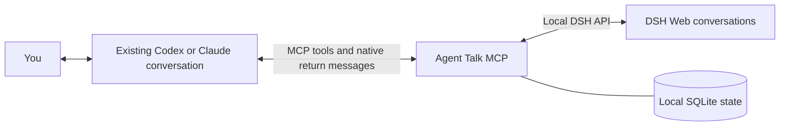

<div align="center">

# Agent Talk MCP

**Let your AI conversations work together — without the copy and paste.**

[English](README.md) · [简体中文](README.zh-CN.md)


[](LICENSE)

A lightweight, local MCP bridge between existing **Codex Desktop / Claude Desktop Code** conversations and **DSH Web**.

</div>

---

## Why it exists

You discuss a task with one AI, write a plan, paste it into another AI, then copy the result back for review. Agent Talk handles that handoff while keeping the conversations in their original apps.

Use your existing Codex or Claude conversation to delegate work to DSH, receive questions and results, and decide what happens next. The bridge does not prescribe a development methodology, repository layout, or fixed planner/executor prompt. It also works for research, writing, and other local tasks.



## What you can do

| Capability | Behavior |
|---|---|
| Use existing conversations | Bind exact native conversation IDs and directories; continue chatting in the original apps. |
| Create DSH conversations | Choose an existing DSH workspace by name, or start in a local directory. |
| Delegate with local files | Send a prompt and absolute paths to Markdown, images, PDFs, or other material. The recipient reads the files using its own capabilities. |
| Receive results and questions | New DSH conversations require a return destination by default. Ordinary questions can be answered from the initiating conversation. |
| Inspect progress | Read recent messages, tool activity, native state, and delivery receipts. |
| Coordinate several tasks | Assign separate DSH conversations to independent work while keeping one initiating conversation per return route. |
| Pause and finish | Pause one task without pausing the others; mark reviewed work complete to prevent reuse. |
| Renew DSH credentials | A small DSH extension supplies the local login URL; the bridge renews its cookie when needed. |

**Scope:** this version automatically creates DSH conversations only. It does not create replacement Codex/Claude CLI sessions, automate browser clicks, or archive conversations.

## Requirements and compatibility

This is an early, source-installed release (`0.4.0`), intended for a trusted local machine.

- **macOS** is the currently supported environment. The Claude native adapter is macOS-only; Windows/Linux support has not been validated.
- **Node.js 22.13 or later** and npm. Node.js **22.23.2** was used for local verification. Node's SQLite experimental warning may appear.
- Codex Desktop and/or **Claude Desktop Code**, signed in and able to run a local stdio MCP server. Regular Claude web chats are not supported by this adapter.
- A working **DSH Web** installation on the same machine, with access to the same local files.
- The native apps and the receiving conversation must remain available for automatic return.

Local verification used **Claude Code 2.1.280** and **DSH 0.1.7-rc.1**, plus the installed Codex Desktop. These are compatibility observations, not a guarantee for every release. Native IPC and DSH RPC interfaces can change independently of MCP.

## Quick start

### 1. Install the source

```sh
git clone https://github.com/YanZiBin/agent-talk-mcp.git
cd agent-talk-mcp
npm ci --ignore-scripts
npm run check
npm run smoke
```

The smoke test uses temporary state and a local mock DSH service. It does not send messages to your AI conversations.

Keep the checkout in a stable location: client configurations and the DSH extension will reference its absolute path. There is no npm package installation required; `private: true` intentionally prevents accidental npm publication.

### 2. Connect DSH and enable credential renewal

Start your existing DSH installation with `dsh web`. Generate the extension URL from the repository root:

```sh
node --input-type=module -e 'import { pathToFileURL } from "node:url"; import path from "node:path"; console.log(pathToFileURL(path.resolve("src/dsh-auth-plugin.mjs")).href)'
```

In the verified DSH version, the Web profile patch file is `~/.dsh/profiles/web/cordis.patch.yml`. Back it up, then append the following item to its existing YAML patch list, replacing the example URL with the command's output. **Preserve existing entries and do not add a duplicate `agent-talk-auth` item.** If the file does not exist, create its parent directory and a file containing this list item.

```yaml
- insert:
    - id: agent-talk-auth
      name: "file:///absolute/path/to/agent-talk-mcp/src/dsh-auth-plugin.mjs"
```

Restart DSH Web, or use its native profile reload mechanism. This is a **DSH Web extension**, not a second MCP server to install in DSH.

The extension obtains a login URL from DSH's own `connection.authenticatedUrl`, saves it privately, and checks credentials every hour. The bridge renews when the cookie has less than 12 hours left, the login URL changes, or authentication is rejected. You do not need to paste a fresh token each time DSH restarts.

<details>
<summary>Manual initial connection or recovery</summary>

If the extension is not available, save the local login URL printed by DSH into `work/dsh-login-url.txt`, then run:

```sh
mkdir -p work
chmod 700 work
# Save the login URL into work/dsh-login-url.txt using your editor.
chmod 600 work/dsh-login-url.txt
npm run connect:dsh < work/dsh-login-url.txt
```

The script does not print tokens or cookies. Do not put the login URL in shell arguments, issues, or commits. Manual login alone does not install automatic renewal; enable the DSH extension for that.

</details>

### 3. Register with Codex and/or Claude Code

From the repository root, in a shell where the relevant client CLI is installed:

```sh
AGENT_TALK_NODE="$(command -v node)"
AGENT_TALK_DIR="$PWD"

# Codex
codex mcp add agent-talk -- "$AGENT_TALK_NODE" "$AGENT_TALK_DIR/src/server.mjs"

# Claude Code, including its Desktop Code environment
claude mcp add --transport stdio --scope user agent-talk -- "$AGENT_TALK_NODE" "$AGENT_TALK_DIR/src/server.mjs"
```

Install only the entries for the clients you use. Alternatively, merge the following entry into the corresponding configuration, substituting **absolute paths**.

**Codex — `~/.codex/config.toml`:**

```toml
[mcp_servers.agent-talk]
command = "/absolute/path/to/node"
args = ["/absolute/path/to/agent-talk-mcp/src/server.mjs"]
```

**Claude Code — user-level MCP configuration:**

```json
{
  "mcpServers": {
    "agent-talk": {
      "type": "stdio",
      "command": "/absolute/path/to/node",
      "args": ["/absolute/path/to/agent-talk-mcp/src/server.mjs"]
    }
  }
}
```

Do not replace your entire configuration with these snippets. Restart or reconnect the clients after setup or source updates. Each client launches its own MCP process; they share local state. No separate boot-time daemon is installed. `npm start` is a stdio server entry point, not an interactive chat command.

### 4. Try it in a conversation

> List the DSH workspaces available on this machine.

Then:

> Create a conversation in the DSH workspace “MyProject”. Ask it to summarize the project without modifying files. Return its questions and result to this conversation, and give me your assessment.

For a development task:

> Give DSH the instructions in `/absolute/path/to/task.md`. Use the “MyProject” workspace. Bring questions and results back here; review the result and ask for revisions as needed. Ask me when a decision is mine to make.

You normally do not need to name the MCP explicitly. The AI selects tools from their descriptions. Tool guidance currently uses Simplified Chinese and instructs clients to follow the user's language; the documentation is available in both English and Simplified Chinese.

## How coordination works

1. The initiating AI identifies its exact native conversation with `talk_list` and binds it with `talk_bind`. It must not guess from a title alone.
2. It creates a DSH conversation with `talk_create`, supplying `replyTo` as its own bound alias. Return is enabled as part of creation; a second `talk_follow` call is unnecessary.
3. It sends the task with `talk_send`, using a stable UUID for the request. Creation itself sends no task.
4. DSH runs in its original conversation. New final replies, ordinary questions, abnormal endings, and direct user interventions can return to the initiator.
5. The initiator interprets the result in the context of the user's goal. It should summarize from its own perspective, distinguish reported claims from verified facts, and quote verbatim only when requested.
6. Revisions can continue in the same executor conversation. Once reviewed work is marked `completed`, use a new conversation for the next task.

`autoReturn: false` explicitly opts out when creating a conversation and must not be combined with `replyTo`. Existing DSH conversations can be bound and then linked with `talk_follow`; starting a follow watches **new** events, not the entire previous history. New defaults do not retroactively enable old routes.

Workspace names must match exactly. Missing names produce an error; duplicate names require an exact `cwd`. If `workspaceName` and `cwd` are both provided, they must agree. Put a separate execution/worktree path in the task instructions. Without a workspace name, `cwd` creates an ungrouped DSH conversation.

## MCP tools

| Tool | Purpose |
|---|---|
| `talk_list` | List native conversations, optionally filtered by exact directory. |
| `talk_workspaces` | Read existing DSH workspace names, directories, and conversation counts. |
| `talk_bind` | Bind an exact native conversation and directory to a stable alias. |
| `talk_create` | Create a DSH conversation with automatic return by default. |
| `talk_send` | Send a prompt and local file paths with request-ID deduplication. |
| `talk_read` | Read recent messages, progress, native state, questions, and return status. |
| `talk_follow` | Enable or disable a DSH → initiating conversation return route. |
| `talk_questions` | Inspect ordinary questions and permission requests. |
| `talk_answer` | Answer ordinary questions; never grant permission approvals. |
| `talk_delivery_control` | Pause, explicitly resume, or mark reviewed work complete. |
| `talk_outbox` | Inspect recent delivery receipts, route errors, and event connectivity. |

Aliases accept 1–64 ASCII letters, digits, underscores, or hyphens. Request IDs must be UUIDs. File references must be existing absolute local paths.

## Delivery states and stopping

| State | Meaning / action |
|---|---|
| `queued` | Not yet sent. Busy or temporarily unavailable recipients wait in a persistent queue. |
| `accepted` | The native app accepted the message. This does not mean the task is complete or reviewed. |
| `observed` | The exact message was found in the native recipient's transcript. |
| `held` | The native recipient retained the message but has not admitted it to the model. Inspect the original client; do not resend. |
| `sending` / `unknown` | The outcome is unconfirmed. Inspect the conversation before taking further action; no automatic replay. |
| `refused` / `unsupported` | The native adapter or recipient rejected the request or lacks support. |
| `cancelled` | An unsent message was cancelled after stopping, completion, route changes, or a question being resolved. |

`talk_read.returnRoute` shows whether return is enabled; `lastReturn` shows its latest receipt. A `held` receipt is not evidence that return is disabled. Its exact internal cause is not supplied by the receipt.

`conversation.state` controls bridge delivery; `nativeStatus` describes the native app. They are separate. Native Stop detection latches bridge delivery as paused. Explicit `active` resumes delivery; a correction in the native app alone does not silently resume it. Pausing DSH requests native cancellation and cancels stale queued prompts. Pausing a Codex/Claude alias gates bridge messages only, not its ongoing model turn.

## Privacy, runtime, and limits

- **Local bridge, not local inference.** Agent Talk adds no hosted relay or model API call of its own. The AI clients still process messages using their configured providers and permissions.
- Private state lives in `.local/`: SQLite coordination state, queued message bodies, question data, and DSH credentials. Treat it as sensitive. The directory is ignored by Git; credential files use mode `600` and their directory mode `700`.
- The DSH auth adapter accepts loopback HTTP addresses only. Native IPC checks ownership and permissions. The extension does not read DSH's signing secret or change client permissions.
- Ordinary questions can be relayed. Permission approvals remain in DSH Web. A peer message does not grant new authority.
- Results are checked every 3 seconds; questions use a DSH event connection. Polling does not call an AI model. Receiving and processing a forwarded message can start a model turn and consume usage.
- At least one MCP process, DSH, and the recipient must be available for return. Closing all MCP processes stops forwarding. There is no guaranteed full catch-up after a long offline period.
- `talk_send` accepts up to 100,000 JavaScript string units, subject to a stricter **120,000-byte assembled message limit**, and at most 30 file paths. Large material should be passed by path. Return messages do not use the same size guard, but native-client and model limits still apply.
- Reads are bounded: up to 40 recent messages; desktop transcript reads inspect the final 2 MiB. `truncated` signals omitted history. Progress is recorded tool activity, not token-by-token streaming.
- One local DSH Web instance is supported. Files are shared by absolute path, not uploaded or synchronized across machines.
- No automatic archive, desktop conversation creation, approval bypass, or built-in Git/worktree/PR policy.

## Troubleshooting

| Symptom | Check |
|---|---|
| Tools are missing or descriptions are old | Reconnect/restart the client's MCP process; check its Node and script paths. |
| DSH cannot authenticate | Confirm DSH Web is running and `agent-talk-auth` is enabled. Use manual login only for recovery; never share `.local/` in an issue. |
| Missing return destination | Bind the exact initiating conversation and pass its alias as `replyTo`. |
| DSH finished but nothing returned | Inspect `returnRoute`, `lastReturn`, and `talk_outbox`. Check paused/busy/unavailable recipients and `held` receipts before resending. |
| Claude target cannot be found | Open an actual Desktop Code conversation. The adapter requires a live native worker; the app window alone is not sufficient. |
| Workspace is missing or ambiguous | Call `talk_workspaces` and use its exact name; provide matching `cwd` for duplicates. |
| Message is too large | Save the material in a local document and send its path. |
| A stopped task does not resume | Explicitly resume with `talk_delivery_control`; cancelled old prompts are not automatically restored. |

## Development and verification

```sh
npm run check
npm run smoke
```

The existing smoke test covers queueing, concurrent deduplication, uncertain delivery, native Stop handling, question validation, approval refusal, workspace resolution, credential renewal, and the MCP tool contract. It also verifies Chinese guidance and default return behavior with isolated mock endpoints. It is not an exhaustive compatibility test against every desktop release.

Real local checks have exercised DSH creation/send/read, workspace selection, question/answer continuation, result return into both Codex and Claude, and credential recovery. All native Stop variants, all reconnect races, long offline catch-up, and every complete development/review workflow have not been exhaustively verified. Claude can return `held` depending on native behavior.

```text
src/server.mjs           MCP tools and coordination guidance
src/adapters.mjs         Native conversation adapters
src/delivery.mjs         Persistent delivery and return polling
src/store.mjs            SQLite state and deduplication
src/dsh-events.mjs       DSH questions and approval notifications
src/dsh-auth.mjs         Private credentials and renewal
src/dsh-auth-plugin.mjs  DSH Web credential extension
src/vendor/              Adapted native IPC code and upstream license
scripts/                Manual connection and smoke checks
```

Contributions are welcome. Keep changes focused, preserve native permission boundaries and no-replay behavior, and run the existing checks. For a bug report, include app versions, tool name, state, and sanitized reproduction steps—not cookies, login URLs, session transcripts, or private task content.

## License and acknowledgments

[MIT](LICENSE). Native IPC portions are adapted from [WebisityStudio/claude-codex-mcp-bridge](https://github.com/WebisityStudio/claude-codex-mcp-bridge); the original MIT notice is preserved. See [THIRD_PARTY.md](THIRD_PARTY.md) for attribution and design references.

This is an independent project, not an official integration from OpenAI, Anthropic, or the DSH maintainers.
