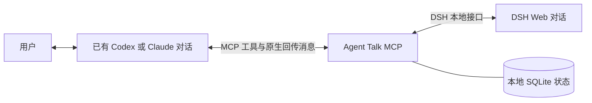

<div align="center">

# Agent Talk MCP

**让 AI 对话协同工作，省去来回复制粘贴。**

[English](README.md) · [简体中文](README.zh-CN.md)


[](LICENSE)

在已有的 **Codex 桌面对话 / Claude Desktop Code 对话** 与 **DSH Web** 之间传递任务、问题和结果的轻量本地 MCP 服务。

</div>

---

## 为什么做这个工具

先和一个 AI 聊清楚任务、写好计划，再复制给另一个 AI 执行，最后把结果复制回来审查——Agent Talk 帮你完成这段交接，同时保留原客户端里的对话。

你可以用已有的 Codex 或 Claude 对话分配任务给 DSH，接收问题和结果，再决定下一步。MCP 不内置固定的开发流程、仓库结构或规划者/执行者提示词，也适用于研究、写作等本地协作任务。



## 可以做什么

| 能力 | 行为 |
|---|---|
| 接入已有对话 | 精确绑定原客户端会话 ID 和目录，随时可以回到原客户端继续聊。 |
| 新建 DSH 对话 | 按名称选择已有 DSH 工作区，或指定本地目录。 |
| 传递本地材料 | 发送提示词和 MD、图片、PDF 等文件的绝对路径，由接收方用自己的工具读取。 |
| 接收结果和问题 | 新建 DSH 对话默认要求配置回传目标；普通问题可由发起对话直接回答。 |
| 查看进度 | 读取近期消息、工具执行情况、运行状态和投递回执。 |
| 同时协调多个任务 | 独立任务分给不同 DSH 对话，每个回传路径指向一个发起对话。 |
| 暂停与收尾 | 只暂停指定任务；审查完成后标记完成，避免继续复用。 |
| 自动续期 DSH 凭据 | 由小型 DSH 扩展提供本地登录地址，桥接服务按需续期 Cookie。 |

**当前范围：**只自动创建 DSH 对话，不创建替代的 Codex/Claude CLI 对话，不依赖浏览器点击，不自动归档。

## 环境要求与兼容性

当前是通过源码安装的早期版本（`0.4.0`），面向可信的本机环境。

- **macOS**：目前支持的环境。Claude 原生适配器仅支持 macOS；Windows/Linux 尚未验证。
- **Node.js 22.13 或更高版本**及 npm。本地验证使用 **22.23.2**；运行时可能出现 Node SQLite 实验性功能提示。
- 已登录的 Codex 桌面端和/或 **Claude Desktop Code**，能够加载本地 stdio MCP。该适配器不支持普通 Claude 网页聊天。
- 同一台电脑上正常运行的 **DSH Web**，并能访问任务所需的本地文件。
- 自动回传时，相关原客户端和接收对话需要保持可用。

本地验证使用 **Claude Code 2.1.280**、**DSH 0.1.7-rc.1** 及当时安装的 Codex 桌面端。这是兼容性记录，并非所有版本的保证；原生 IPC 和 DSH RPC 接口可能随客户端版本变化。

## 快速开始

### 1. 安装源码

```sh
git clone https://github.com/YanZiBin/agent-talk-mcp.git
cd agent-talk-mcp
npm ci --ignore-scripts
npm run check
npm run smoke
```

冒烟测试使用临时数据和本地模拟 DSH 服务，不会向你的 AI 对话发送消息。

请把项目放在稳定目录。客户端配置和 DSH 扩展都会引用这里的绝对路径。无需安装 npm 发布包；`private: true` 用于防止误发布到 npm。

### 2. 连接 DSH，开启凭据续期

使用 `dsh web` 启动已有的 DSH。在项目根目录生成扩展地址：

```sh
node --input-type=module -e 'import { pathToFileURL } from "node:url"; import path from "node:path"; console.log(pathToFileURL(path.resolve("src/dsh-auth-plugin.mjs")).href)'
```

已验证的 DSH 版本使用 `~/.dsh/profiles/web/cordis.patch.yml` 作为 Web 配置补丁文件。先备份，再向原有 YAML 补丁列表追加以下条目，把示例地址替换成上面命令的输出。**保留已有内容，不要重复添加 `agent-talk-auth`。** 文件不存在时，可创建父目录，并以此列表条目作为文件内容。

```yaml
- insert:
    - id: agent-talk-auth
      name: "file:///absolute/path/to/agent-talk-mcp/src/dsh-auth-plugin.mjs"
```

重启 DSH Web，或使用 DSH 原生的配置重载方式。这是 **DSH Web 扩展**，不需要在 DSH 里再安装一份 MCP 服务。

扩展通过 DSH 自身的 `connection.authenticatedUrl` 获取登录地址，私密保存，并每小时检查凭据。Cookie 剩余不足 12 小时、登录地址变化或认证被拒绝时，桥接服务会重新登录续期；不必每次重启 DSH 都复制 token。

<details>
<summary>手动首次连接或恢复连接</summary>

如果扩展暂时不可用，可将 DSH 启动时输出的本地登录地址保存到 `work/dsh-login-url.txt`，然后运行：

```sh
mkdir -p work
chmod 700 work
# 用编辑器将登录地址保存到 work/dsh-login-url.txt。
chmod 600 work/dsh-login-url.txt
npm run connect:dsh < work/dsh-login-url.txt
```

脚本不输出 token 或 Cookie。不要把登录地址放进命令行参数、Issue 或 Git 提交。手动登录不会安装自动续期功能；要持续续期，仍需启用 DSH 扩展。

</details>

### 3. 配置 Codex 和/或 Claude Code

在项目根目录运行，所用客户端的 CLI 需要已安装：

```sh
AGENT_TALK_NODE="$(command -v node)"
AGENT_TALK_DIR="$PWD"

# Codex
codex mcp add agent-talk -- "$AGENT_TALK_NODE" "$AGENT_TALK_DIR/src/server.mjs"

# Claude Code，包括其 Desktop Code 环境
claude mcp add --transport stdio --scope user agent-talk -- "$AGENT_TALK_NODE" "$AGENT_TALK_DIR/src/server.mjs"
```

只配置你使用的客户端即可。也可以将以下条目合并进对应配置，并换成实际的**绝对路径**。

**Codex — `~/.codex/config.toml`：**

```toml
[mcp_servers.agent-talk]
command = "/absolute/path/to/node"
args = ["/absolute/path/to/agent-talk-mcp/src/server.mjs"]
```

**Claude Code — 用户级 MCP 配置：**

```json
{
  "mcpServers": {
    "agent-talk": {
      "type": "stdio",
      "command": "/absolute/path/to/node",
      "args": ["/absolute/path/to/agent-talk-mcp/src/server.mjs"]
    }
  }
}
```

不要用示例覆盖整个原配置。配置完成或源码更新后，重启或重新连接客户端。每个客户端启动自己的 MCP 进程，共享本地状态；不会另装开机启动的常驻服务。`npm start` 是 stdio 服务入口，不是交互聊天命令。

### 4. 在对话里试用

先说：

> 列一下这台电脑上的 DSH 工作区。

再说：

> 在 DSH 的 MyProject 工作区新建一个对话，让它只读总结项目内容，不要改文件。问题和结果回到当前对话，你理解之后再给我总结。

开发任务可以这样说：

> 把 `/absolute/path/to/task.md` 中的任务交给 DSH，在 MyProject 工作区执行。问题和结果回到这里，你审查后再决定是否需要返工，需要我决定的事情再问我。

一般不用显式提及 MCP 名称，AI 会根据工具说明选择调用。工具指引目前为简体中文，并要求回复跟随用户语言；项目文档提供英文和简体中文两版。

## 协作是怎样进行的

1. 发起方用 `talk_list` 确认自己的原生会话，再用 `talk_bind` 绑定。不能只凭相同标题猜测会话。
2. 用 `talk_create` 创建 DSH 对话，把自己的已绑定别名填入 `replyTo`。创建时就会开启回传，无需额外调用 `talk_follow`。
3. 用 `talk_send` 发送任务，保持请求 UUID 稳定。创建对话本身不会派发任务。
4. DSH 在原客户端中执行，新增的最终回复、普通问题、异常结束和用户直接介入的消息可以回到发起方。
5. 发起方理解结果后继续与用户沟通，遵循下面这条通用指引。
6. 返工可沿用同一个执行对话；审查通过并标记 `completed` 后，新任务使用新对话。

> 收到其他 AI 的回复后，先结合当前对话的目标和上下文理解、判断，再以自己的视角向用户简洁汇报。默认不直接照搬原文，也不把对方的说法当作自己已经核实的事实；用户另有要求时，以用户要求为准。

创建时可用 `autoReturn: false` 明确关闭回传，此时不能再传 `replyTo`。已有 DSH 对话可以先绑定，再用 `talk_follow` 建立回传；开启时只关注**新增事件**，不自动搬运全部旧历史。新默认值不会追溯修改旧对话的设置。

工作区名称需精确匹配。不存在时报错，同名时需传精确 `cwd` 区分；同时传入 `workspaceName` 和 `cwd` 时目录必须一致。另行使用的开发目录或 worktree 路径写进任务提示词。不指定工作区名称时，用 `cwd` 创建未分组对话。

## MCP 工具

| 工具 | 用途 |
|---|---|
| `talk_list` | 列出原客户端对话，可按精确目录筛选。 |
| `talk_workspaces` | 读取已有 DSH 工作区的名称、目录和对话数量。 |
| `talk_bind` | 将精确的会话及目录绑定到固定别名。 |
| `talk_models` | 读取 DSH 可用模型、可选思考程度，以及是否支持快速档。 |
| `talk_create` | 创建 DSH 对话，默认开启自动回传；可选 `model`、`effort`、`speed` 指定模型、思考程度和速度（选模型会同时成为 DSH 之后的默认模型；快速档仅限 codex 模型，DSH 重启后恢复标准速度）。 |
| `talk_send` | 发送提示词和本地文件路径，按请求 ID 防重复。 |
| `talk_read` | 读取近期消息、进度、运行状态、问题和回传状态。 |
| `talk_follow` | 开启或关闭 DSH 到发起对话的回传。 |
| `talk_questions` | 查看普通问题和权限请求。 |
| `talk_answer` | 回答普通问题，不代答权限审批。 |
| `talk_delivery_control` | 暂停、明确恢复或标记审查完成。 |
| `talk_outbox` | 查看近期回执、回传错误和事件连接状态。 |

别名支持 1–64 位英文字母、数字、下划线或连字符；请求 ID 必须是 UUID；引用文件必须是本机已存在的绝对路径。

## 投递状态与停止行为

| 状态 | 含义与处理 |
|---|---|
| `queued` | 尚未发送，接收方忙碌或暂时不可用时持久排队。 |
| `accepted` | 原客户端已接受，不代表任务完成或审查通过。 |
| `observed` | 已从接收方原始记录中读回完全一致的消息。 |
| `held` | 原客户端已暂存，但尚未交给模型。检查原客户端，不要重发。 |
| `sending` / `unknown` | 结果未确认，先检查原对话，不自动重发。 |
| `refused` / `unsupported` | 原客户端或适配器拒绝请求，或不支持相应能力。 |
| `cancelled` | 因停止、完成、回传变更或问题解决，取消了尚未发出的消息。 |

`talk_read.returnRoute` 表示是否开启回传，`lastReturn` 表示最近一次回传回执。`held` 不代表回传没开启；回执本身没有说明客户端内部暂存的具体原因。

`conversation.state` 控制 MCP 投递，`nativeStatus` 是原客户端状态，两者分开保留。识别到原客户端停止后，桥接保持暂停，需要明确设置 `active` 恢复；用户直接纠偏续聊不会悄悄恢复桥接。暂停 DSH 会同时请求原生停止、取消旧的排队提示；暂停 Codex/Claude 别名只停止桥接投递，不中止其模型当前正在做的工作。

## 隐私、运行方式与限制

- **本地桥接，不等于本地推理。** Agent Talk 自身不增加云端中转或模型 API 调用；消息仍由各 AI 客户端按其模型服务和权限处理。
- `.local/` 保存 SQLite 协作状态、排队消息正文、问题数据和 DSH 凭据，应按敏感数据保管。该目录被 Git 忽略；凭据文件权限为 `600`，目录权限为 `700`。
- DSH 认证适配器只接受本机回环 HTTP 地址；原生 IPC 会检查所有者和权限。扩展不读取 DSH 签名密钥，不改变客户端权限。
- 普通问题可以转交；权限审批仍在 DSH Web 处理。其他 AI 的消息不会授予新权限。
- 每 3 秒检查新结果，普通问题通过 DSH 事件连接接收。轮询不会调用模型；回传消息被接收并处理后，可能开启新的模型轮次并消耗额度。
- 自动回传需要至少一个 MCP 进程、DSH 和接收端可用。全部 MCP 关闭后停止转发，不保证长时间离线后的完整补传。
- `talk_send` 的提示词上限为 100,000 个 JavaScript 字符串计数单位，同时整条拼接消息不得超过 **120,000 字节**，最多携带 30 个文件路径。长材料建议传文件路径。回传消息没有套用同一大小检查，但仍受原客户端和模型限制。
- 读取最多返回近期 40 条消息，桌面对话记录只读取末尾 2 MiB；`truncated` 表示省略了更早历史。进度是已记录的工具调用情况，不是逐 token 直播。
- 目前支持一个本机 DSH Web 实例；文件按绝对路径共享，不提供跨机器上传或同步。
- 不自动归档，不自动新建桌面对话，不绕过审批，不内置 Git、worktree 或 PR 流程。

## 常见问题

| 现象 | 检查方式 |
|---|---|
| 工具没出现或说明还是旧的 | 重连或重启客户端 MCP，检查 Node 和脚本路径。 |
| DSH 登录失败 | 确认 DSH Web 正在运行，`agent-talk-auth` 已启用；必要时手动恢复登录，不要把 `.local/` 发到 Issue。 |
| 提示缺少回传目标 | 精确绑定当前发起对话，并把别名传给 `replyTo`。 |
| DSH 完成却没收到结果 | 查 `returnRoute`、`lastReturn` 和 `talk_outbox`，确认接收方是否暂停、忙碌、不可用或暂存消息；不要盲目重发。 |
| 找不到 Claude 接收对话 | 打开实际的 Desktop Code 对话；仅打开应用窗口不一定启动原生工作进程。 |
| 工作区不存在或重名 | 用 `talk_workspaces` 获取精确名称，重名时再填对应 `cwd`。 |
| 消息过长 | 把内容保存到本地文档，只发送路径。 |
| 停止后不继续 | 用 `talk_delivery_control` 明确恢复；已取消的旧提示不会自动恢复。 |

## 开发与验证

```sh
npm run check
npm run smoke
```

现有冒烟测试覆盖排队、并发防重、不确定结果不重发、停止识别、问题校验、拒绝代答审批、工作区匹配、凭据续期和 MCP 工具契约，也会通过隔离模拟接口验证中文指引与默认回传。这不代表已测试所有客户端版本。

真实本机联调已走通 DSH 创建/发送/读取、工作区选择、提问后回答继续执行、回传到 Codex 和 Claude、凭据恢复。尚未穷尽验证所有原生停止形式、断线并发场景、长时间离线补传及完整开发审查流程；Claude 仍可能因原客户端行为返回 `held`。

```text
src/server.mjs           MCP 工具和协作指引
src/adapters.mjs         原客户端适配器
src/delivery.mjs         持久投递和结果轮询
src/store.mjs            SQLite 状态与防重
src/dsh-events.mjs       DSH 提问和权限通知
src/dsh-auth.mjs         私有凭据与续期
src/dsh-auth-plugin.mjs  DSH Web 凭据扩展
src/vendor/              改编的原生 IPC 代码与上游许可证
scripts/                手动连接与冒烟检查
```

欢迎贡献。改动保持集中，保留原客户端权限边界和不确定写入不重发的行为，并运行现有检查。反馈问题时提供应用版本、工具名、状态和脱敏后的复现步骤，不要附 Cookie、登录地址、完整对话记录或私人任务内容。

## 许可证与致谢

采用 [MIT 许可证](LICENSE)。部分原生 IPC 代码改编自 [WebisityStudio/claude-codex-mcp-bridge](https://github.com/WebisityStudio/claude-codex-mcp-bridge)，保留了原始 MIT 版权声明。来源及设计参考见 [THIRD_PARTY.md](THIRD_PARTY.md)。

这是独立项目，不是 OpenAI、Anthropic 或 DSH 维护方提供的官方集成。
